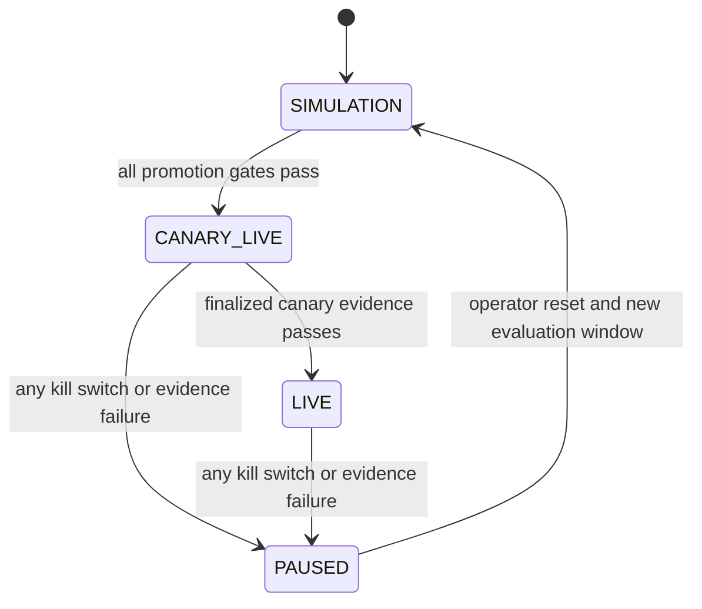

# Autonomous simulation-to-mainnet specification

Status: implementation specification for the truth-layer release

## Goal

Use historical and current BSC market data to simulate a strategy. When the
strategy and the current opportunity satisfy the 85% evidence gate, promote
automatically to a tightly capped BSC mainnet canary. Scale beyond canary only
after finalized receipts prove that the live path behaves like the simulation.

This is the system goal. "85%" is a statistical and operational gate, not a
display value and not permission to bypass risk controls.

## Execution state machine



`CANARY_LIVE` and `LIVE` are mainnet states. Promotion into either state is
automatic when every gate passes. There is no client-side override.

## Default promotion gates

| Gate | Default | Failure action |
| --- | ---: | --- |
| Current calibrated probability of positive net PnL | >= 0.85 | remain simulation |
| One-sided 95% Wilson lower bound | >= 0.85 | remain simulation |
| Walk-forward out-of-sample sample count | >= 200 | remain simulation |
| Brier loss | <= 0.10 | remain simulation |
| Expected calibration error | <= 0.05 | remain simulation |
| Profit factor after all costs | >= 1.25 | remain simulation |
| Maximum simulated drawdown | <= 5% | remain simulation |
| Deployment readiness | 3 healthy regions, private relays, chain-56 RPC, signer, deployed executor, secret configuration | remain simulation |
| Current-data age | <= 900 ms | reject opportunity |
| C++ kernel expected net profit | > 0 | reject opportunity |
| Atomic `eth_call`/builder simulation | successful | reject opportunity |
| Protected/private relay | required | reject opportunity |
| Canary live notional | <= USD 25 | cap transaction |
| Canary finalized executions before scale | >= 20 | remain canary |
| Finalized receipt mismatch/revert | zero allowed | pause immediately |

All money calculations use integer micro-USD or token base units. Floating point
is limited to reporting and the statistical gate.

## Data contracts

Historical and current observations share one schema:

```json
{
  "observationId": "immutable-id",
  "observedAt": "2026-08-01T00:00:00Z",
  "strategy": "atomic_v2_arbitrage",
  "features": {
    "grossProfitUsdMicros": 1700000,
    "gasUsdMicros": 120000,
    "relayUsdMicros": 30000,
    "slippageUsdMicros": 90000,
    "notionalUsdMicros": 20000000,
    "availableLiquidityUsdMicros": 5000000000,
    "calibratedProbabilityPpm": 930000,
    "dataAgeMs": 120,
    "estimatedLatencyMs": 180
  },
  "simulation": {
    "success": true,
    "stateBlock": 54321000,
    "stateBlockHash": "0x...",
    "callResultHash": "0x..."
  }
}
```

Simulation results add the realized simulated outcome, all costs, and model
version. Live results replace simulated outcome with the evidence contract below.

The always-on scanner posts each unique reserve-state opportunity to a
server-only observation endpoint. Firestore rejects duplicate observation/state
hashes, retains the ordered window, and the Rust replay engine recomputes
prequential probability calibration, Brier loss, expected calibration error,
profit factor, and drawdown after every observation. The control plane evaluates
promotion immediately after that recomputation. If the result is
`CANARY_LIVE`/`LIVE`, the same opportunity proceeds to simulation, signing, and
private submission without a browser action.

## Native services

### Rust orchestrator

- consumes replay observations and current opportunities;
- subscribes to BSC `newHeads`, reads configured V2 pair reserves at the named
  block, and evaluates constant-product routes with integer arithmetic;
- calls the fixed-allocation C++ decision kernel;
- evaluates the promotion state machine;
- talks to BSC JSON-RPC and configured private relays;
- fans out identical signed bytes with a deterministic idempotency key;
- waits for receipt inclusion and the `finalized` block tag;
- emits typed evidence, health, and latency metrics;
- defaults to `SIMULATION` and rejects live calls unless deployment configuration,
  promotion evidence, a server service token, and a server-side signer are present.

### C++ kernel

- performs the allocation-free hot-path cost/risk calculation through a stable C
  ABI;
- subtracts gas, relay cost, and slippage from gross profit using checked integer
  arithmetic;
- applies probability, latency, liquidity, notional, freshness, simulation, and
  protected-route limits;
- calculates the Wilson lower bound used by the Rust policy;
- returns a rejection bitmask; it never submits or signs a transaction.

### Node control plane

- authenticates the Firebase user;
- stores promotion decisions and live evidence under that user;
- never trusts mode, profit, or receipt fields from the browser;
- proxies only allowlisted native operations with a server-to-server token;
- loads signer/relay/Telegram secrets only from the server environment;
- sends Telegram messages only after finalized reconciliation.

## One verifiable end-to-end path

The first live path is an atomic, backrun-safe, two-router V2 arbitrage executed
through an allowlisted contract:

1. Observe reserves and a triggering transaction from a local BSC node/private
   stream.
2. Re-simulate both swaps against a named block hash.
3. Score net profit through the C++ kernel.
4. Evaluate promotion gates against the current walk-forward evidence window.
5. Encode the allowlisted atomic executor call with `minimumProfit` and a deadline.
6. Sign once in the server-side signer; fan out the identical signed transaction
   in a private bundle from the three regions.
7. Poll the canonical RPC for the transaction receipt and the `finalized` block.
8. Verify status, chain, sender, executor address, calldata commitment, token
   balance deltas, block hash, and minimum profit.
9. Persist immutable evidence. Only now update realized PnL or notify Telegram.

Public-mempool fallback is not permitted for this path.

## Evidence schema

Each live attempt must end in exactly one terminal evidence state:

- `FINALIZED_PROFIT`
- `FINALIZED_LOSS`
- `REVERTED`
- `EXPIRED_NOT_INCLUDED`
- `EVIDENCE_MISMATCH`

Evidence includes user id, strategy and model versions, opportunity hash,
calldata hash, raw-transaction hash, relay acknowledgements, submission region
and timestamps, inclusion block/hash, finalized block/hash, gas paid, before/after
base-unit balances, realized base-unit PnL, USD valuation source/time, and all
promotion-gate inputs. Relay acknowledgements alone are never terminal success.

## Geographic race and nonce safety

The control plane owns the account nonce and signs only once. Regional workers
receive the same signed payload. Idempotency is `(chainId, from, nonce, calldata
hash)`. A worker may submit but may not mutate or re-sign. A replacement requires
a new signed payload and explicit replacement generation. This preserves the
latency benefit of regional fan-out without creating three trades.

## Kill switches

Any of the following forces `PAUSED`: receipt mismatch, a revert in canary,
finality timeout, stale current data, relay/public-route downgrade, daily loss
limit, drawdown breach, nonce divergence, signer-address mismatch, contract
allowlist mismatch, RPC chain mismatch, calibration drift, or evidence-store
failure.

Deployment readiness is part of promotion, not a post-promotion warning. It is
false unless all Tokyo, Frankfurt, and Northern Virginia workers report live
execution enabled, chain RPC and at least one private relay; server-side signer,
allowlists, and internal tokens exist; the canonical RPC reports chain 56; and
the configured executor address has deployed bytecode.

## Deployment boundary

Code, containers, tests, and Terraform may be prepared and validated locally.
The following are explicitly deferred until billing authorization:

- enabling billable Google APIs;
- creating Compute Engine workers, static IPs, Cloud NAT, load balancers, or
  paid monitoring resources;
- provisioning paid relay accounts;
- creating/importing a funded mainnet execution key;
- deploying/funding the executor contract;
- executing a mainnet smoke trade.

The post-authorization smoke test uses the canary cap and produces one complete,
finalized evidence record or a terminal failure record. It does not expand the
feature surface.
